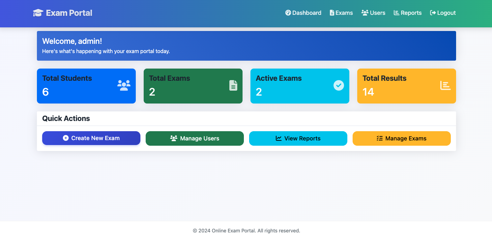
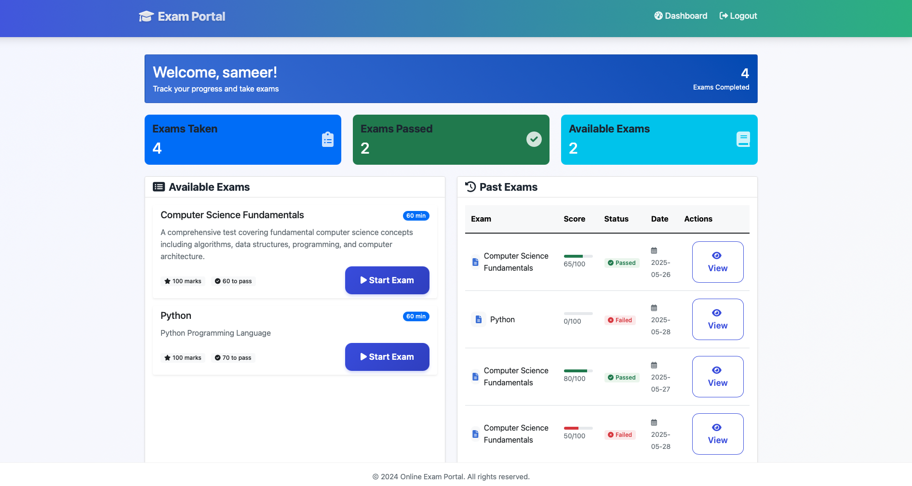
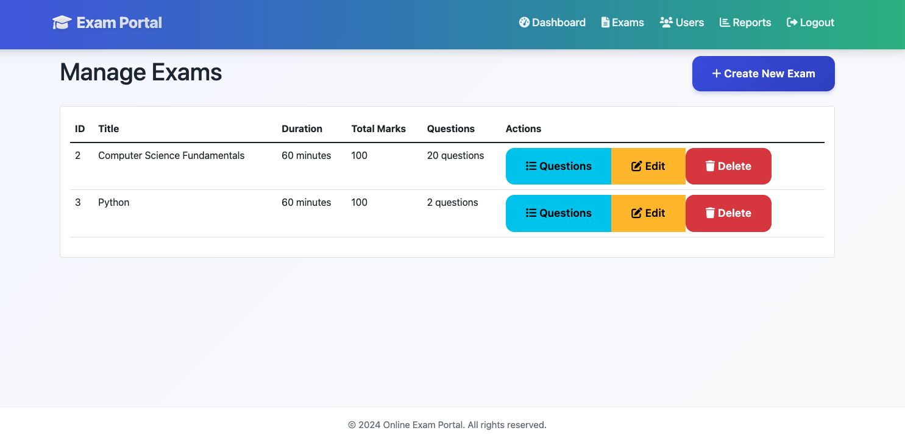
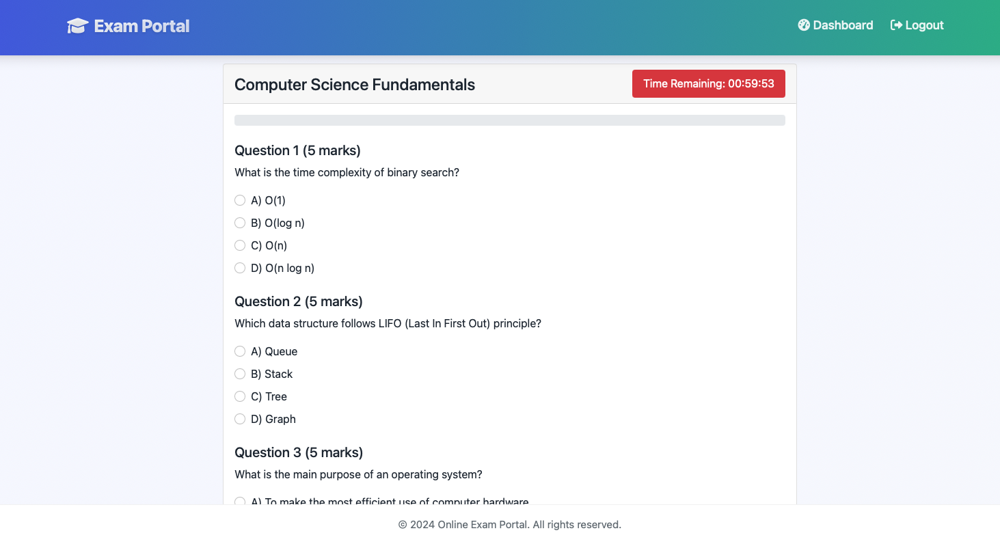

# Online Exam Portal

A comprehensive web-based examination system built with Flask, allowing administrators to create and manage exams while students can take tests and view their results.

## Features

### Admin Features

1. **Dashboard**
   - Quick statistics overview (Total Students, Total Exams, Active Exams, Total Results)
   - Quick action buttons for common tasks
   - Modern and responsive UI

2. **User Management**
   - Create new users (students/admins)
   - View all registered users
   - Edit user details
   - Delete users
   - Assign exams to specific students

3. **Exam Management**
   - Create new exams
   - Set exam parameters:
     - Title and description
     - Duration
     - Total marks
     - Passing marks
   - Add/edit/delete questions
   - Set exam status (active/inactive)
   - Delete exams with cascade deletion

4. **Reports and Analytics**
   - View comprehensive exam results
   - Filter results by:
     - Specific exam
     - Date range
     - Pass/Fail status
   - Statistics display:
     - Total attempts
     - Pass rate
     - Average score
     - Unique students
   - Export results to CSV
   - View individual result details

### Student Features

1. **Dashboard**
   - View available exams
   - See past exam results
   - Quick access to active exams

2. **Exam Taking**
   - Take available exams
   - Timer countdown
   - Auto-submit when time expires
   - View results immediately after submission

3. **Result Review**
   - View detailed exam results
   - See correct/incorrect answers
   - Check score and pass/fail status
   - View time taken

## Screenshots

### Admin Interface

1. **Admin Dashboard**
   
   - Overview of system statistics
   - Quick access to main functions
   - Recent exam results

2. **User Management**
   
   - List of all users
   - User creation and editing
   - Role assignment

3. **Exam Management**
   
   - List of all exams
   - Exam creation and editing
   - Question management

4. **Reports and Analytics**
   
   - Comprehensive result viewing
   - Filtering and sorting options
   - Statistical analysis

### Student Interface

1. **Student Dashboard**
   
   - Available exams
   - Past results
   - Quick exam access

2. **Exam Taking**
   
   - Question display
   - Timer
   - Answer submission

3. **Result View**
   
   - Detailed score breakdown
   - Correct/incorrect answers
   - Performance analysis

### Key Features

1. **Responsive Design**
   
   - Mobile-friendly interface
   - Adaptive layouts
   - Touch-optimized controls

2. **Interactive Elements**
   
   - Progress bars
   - Dynamic filters
   - Real-time updates

Note: Place your screenshots in the `screenshots` folder and name them according to the structure above. Recommended screenshot size: 1280x720 pixels or 1920x1080 pixels for high resolution.

## Technical Details

### Database Schema

1. **User Model**
   ```python
   class User:
       - id (Primary Key)
       - username (Unique)
       - email (Unique)
       - password_hash
       - is_admin (Boolean)
       - created_at (DateTime)
       - exams_taken (Relationship)
   ```

2. **Exam Model**
   ```python
   class Exam:
       - id (Primary Key)
       - title
       - description
       - duration (minutes)
       - total_marks
       - passing_marks
       - created_by (Foreign Key)
       - created_at
       - is_active
       - questions (Relationship)
       - results (Relationship)
   ```

3. **Question Model**
   ```python
   class Question:
       - id (Primary Key)
       - exam_id (Foreign Key)
       - question_text
       - option_a
       - option_b
       - option_c
       - option_d
       - correct_answer
       - marks
   ```

4. **ExamResult Model**
   ```python
   class ExamResult:
       - id (Primary Key)
       - exam_id (Foreign Key)
       - user_id (Foreign Key)
       - score
       - total_marks
       - start_time
       - end_time
       - is_passed
       - answers (Relationship)
   ```

5. **UserAnswer Model**
   ```python
   class UserAnswer:
       - id (Primary Key)
       - result_id (Foreign Key)
       - question_id (Foreign Key)
       - selected_answer
       - is_correct
   ```

### Setup Instructions

1. **Prerequisites**
   - Python 3.8 or higher
   - pip (Python package manager)
   - Virtual environment (recommended)

2. **Installation**
   ```bash
   # Clone the repository
   git clone https://github.com/sameeralam3127/Online-Exam-portal.git
   cd Online-Exam-portal

   # Create and activate virtual environment
   python -m venv venv
   source venv/bin/activate  # On Windows: venv\Scripts\activate

   # Install dependencies
   pip install -r requirements.txt
   ```

3. **Running the Application**
   ```bash
   # Start the Flask application
   python app.py
   ```
   The application will create a new database and sample data on first run.

4. **Default Credentials**
   - Admin:
     - Username: admin
     - Password: admin123
   - Student:
     - Username: student1
     - Password: student123

### Port Configuration

The application attempts to use the following ports in order:
- 5001 (primary)
- 5002 (fallback)
- 5003 (fallback)
- 5004 (fallback)
- 5005 (fallback)

If you're on macOS and experiencing port conflicts:
1. Go to System Settings > General > AirDrop & Handoff
2. Disable AirPlay Receiver
3. Or specify a different port when running: `FLASK_RUN_PORT=8080 python app.py`

## Security Features

1. **Authentication**
   - Password hashing using Werkzeug's security functions
   - Session management with Flask-Login
   - Role-based access control (Admin/Student)

2. **Data Protection**
   - CSRF protection on forms
   - Secure password storage
   - Input validation and sanitization

## UI Features

1. **Modern Design**
   - Clean and responsive layout
   - Bootstrap 5 framework
   - Font Awesome icons
   - Custom CSS styling

2. **Interactive Elements**
   - Progress bars for scores
   - Dynamic filtering
   - Responsive tables
   - Modal confirmations
   - Toast notifications

## Error Handling

- Custom error pages (404, 500)
- Form validation errors
- Database integrity errors
- Cascade deletion handling
- Session timeout handling

## Best Practices

1. **Code Organization**
   - MVC-like structure
   - Modular templates
   - Separation of concerns
   - Clear naming conventions

2. **Performance**
   - Database indexing
   - Eager loading of relationships
   - Efficient query optimization
   - Proper cascade configurations

3. **Maintenance**
   - Detailed logging
   - Error tracking
   - Database backups
   - Version control

## Future Enhancements

1. **Planned Features**
   - Multiple question types
   - File upload questions
   - Randomized question order
   - Question bank
   - Batch user import
   - Result analytics graphs
   - Email notifications
   - PDF result export

2. **Technical Improvements**
   - API documentation
   - Unit tests
   - Docker containerization
   - CI/CD pipeline
   - Performance monitoring
   - Backup automation 